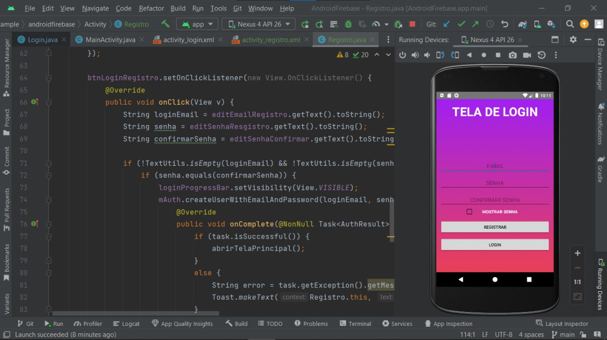

# LOGIN COM FIREBASE
👨‍🏫PROJETO CRIADO PARA O CURSO DE ANDROID STUDIO EM JAVA.

 <br>

## DESCRIÇÃO:
O aplicativo "Login com Firebase" permite aos usuários autenticarem-se em um sistema utilizando a plataforma Firebase Authentication do Google. 

## FUNCIONALIDADES:
1. **Login de Usuário**:
   - Permite que os usuários façam login em suas contas utilizando endereço de e-mail e senha.
   - Valida os dados inseridos pelo usuário e trata erros de autenticação.

2. **Registro de Novos Usuários**:
   - Oferece a funcionalidade de registro para novos usuários, onde podem criar contas utilizando um endereço de e-mail e senha.
   - Verifica se os dados fornecidos estão corretos e trata possíveis erros durante o processo de registro.

3. **Segurança de Senha**:
   - Inclui a opção de ocultar ou exibir a senha durante a digitação, proporcionando mais segurança e praticidade aos usuários.

4. **Redirecionamento de Telas**:
   - Após o login bem-sucedido, os usuários são redirecionados para a tela principal do aplicativo.
   - Após o registro, os usuários também são redirecionados para a tela de login para acessar suas contas recém-criadas.

5. **Gerenciamento de Sessão**:
   - No `MainActivity`, verifica se o usuário está autenticado ao iniciar a atividade. Se não estiver autenticado, redireciona-o para a tela de login.

6. **Tratamento de Erros**:
   - Oferece tratamento de erros detalhado para problemas comuns durante o processo de autenticação, como senhas fracas, endereços de e-mail inválidos ou duplicados.

## EXECUTANDO O PROJETO NO ANDROID STUDIO:
### ADICIONAR FIREBASE AO PROJETO ANDROID:
1. **Criar Projeto no Firebase Console**:
   - Vá para o [Firebase Console](https://console.firebase.google.com/).
   - Clique em "Adicionar Projeto" e siga as instruções para criar um novo projeto.

2. **Registrar o App no Firebase**:
   - No painel do projeto Firebase, clique no ícone do Android para adicionar um aplicativo Android.
   - Adicione o nome do pacote do seu app Android (você pode encontrá-lo no arquivo `AndroidManifest.xml`).
   - Siga as instruções para baixar o arquivo `google-services.json`.

3. **Adicionar `google-services.json` ao Projeto**:
   - Coloque o arquivo `google-services.json` na pasta `app` do seu projeto Android.

4. **Adicionar Dependências do Firebase**:
   - Abra o arquivo `build.gradle` do projeto (`build.gradle (Project: <your-project>)`) e adicione a classe de serviços do Google:
      ```gradle
      buildscript {
         repositories {
               // ...
               google() // Adicione esta linha
         }
         dependencies {
               // ...
               classpath 'com.google.gms:google-services:4.3.10' // Adicione esta linha
         }
      }
      ```
   - No arquivo `build.gradle (Module: app)`, adicione as dependências do Firebase
   
### ABRINDO O PROJETO:
   - **Preparação do ambiente**:
     1. Certifique-se de que você tenha o [Android Studio](https://developer.android.com/studio) instalado em sua máquina.
     2. Instale as dependências necessárias (SDKs, emuladores, etc.) conforme indicado pela documentação do Android Studio.

   - **Abrindo o projeto no Android Studio**:
     1. Abra o Android Studio.
     2. Na tela de boas-vindas, selecione `Open an existing project`.
     3. Navegue até o diretório `./CODIGO` onde o projeto foi clonado e selecione-o.
     4. Aguarde enquanto o Android Studio indexa o projeto e baixa as dependências necessárias.

   - **Executando o projeto**:
     1. Conecte um dispositivo Android via USB ou configure um emulador de dispositivo Android no Android Studio.
     2. Certifique-se de que o dispositivo/emulador está selecionado na barra de dispositivos do Android Studio.
     3. Clique no botão `Run` (ícone de play) para compilar e executar o aplicativo.

   - **Depuração**:
     - Para iniciar a depuração, clique no botão `Debug` (ícone de inseto) e siga as instruções do Android Studio para definir pontos de interrupção e inspecionar variáveis.

### GERANDO O APK:
   Depois de melhorar o projeto, você pode gerar o APK novamente. Siga os passos abaixo para gerar o APK usando o Android Studio:

   1. **Abrir o Projeto**:
      - Abra o Android Studio.
      - Vá para `File` > `Open...` e selecione o diretório `./CODIGO` do seu projeto.

   2. **Construir o Projeto**:
      - Certifique-se de que todas as dependências estejam atualizadas e que o projeto esteja compilando corretamente.
      - Vá para `Build` > `Clean Project` para limpar o projeto.
      - Depois, vá para `Build` > `Rebuild Project` para reconstruir o projeto.

   3. **Gerar o APK**:
      - Vá para `Build` > `Build Bundle(s) / APK(s)` > `Build APK(s)`.
      - O Android Studio começará a compilar o projeto e a gerar o APK.
      - Após a conclusão, uma notificação aparecerá no canto inferior direito da tela com a mensagem `APK(s) generated successfully.`
      - Clique na notificação ou vá para `locate` para encontrar o APK gerado, que geralmente está localizado em `./app/build/outputs/apk/release/`.

   4. **Testar o APK**:
      - Transfira o APK gerado para o seu dispositivo Android e instale-o conforme as instruções na seção **EXECUTANDO O PROJETO** > **APK** acima.

## CREDITOS:
- [PROJETO FEITO PELO VILHALVA](https://github.com/VILHALVA)
- [PROJETO CRIADO PARA O CURSO DE ANDROID STUDIO EM JAVA](https://github.com/VILHALVA/CURSO-DE-ANDROID-STUDIO-EM-JAVA)


